<div align="center">

# SOC SHIFT:30

### 새벽 3시 17분. 오늘 밤 이 관제실에는 당신 혼자입니다.

경보 하나를 읽고 **통과시킬지 막을지** 정하세요. 근무는 **30초**입니다.

**[▶ 지금 플레이하기](https://myeongjundev.github.io/mini-game/)**

설치도 로그인도 없습니다. 링크를 누르면 바로 시작합니다.

<br>

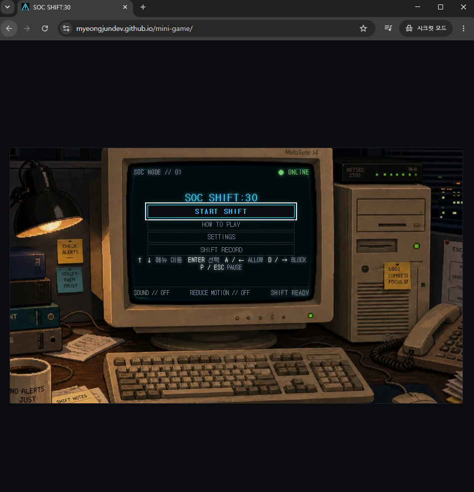

<br><br>


</div>

---

## 30초 안에 이해하는 규칙

경보가 한 장씩 뜹니다. 표에 적힌 사실 네 줄을 읽고 결정하세요.

| 조작 | 키 |
|---|---|
| **ALLOW** — 정상 트래픽이다, 통과시킨다 | `A` 또는 `←` |
| **BLOCK** — 위협이다, 막는다 | `D` 또는 `→` |

- **라이프 3개.** 틀리거나 3초 안에 못 정하면 하나 잃습니다.
- **정답 +100점**, 심각도 `CRITICAL` 정답은 **+300점**.
- **3연속부터 콤보 보너스.** 한 번 틀리면 0으로 돌아갑니다.

마우스로도, 키보드로도, 휴대폰 터치로도 끝까지 할 수 있습니다.

### 한 번의 조작이 한 번의 변화로

<table>
<tr>
<td width="50%">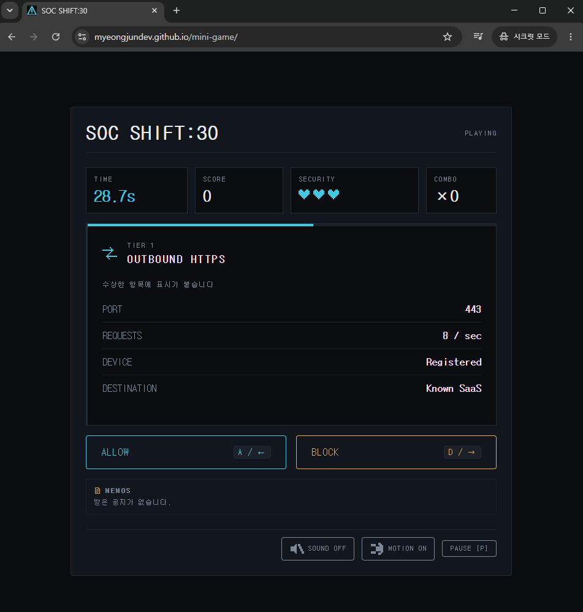</td>
<td width="50%">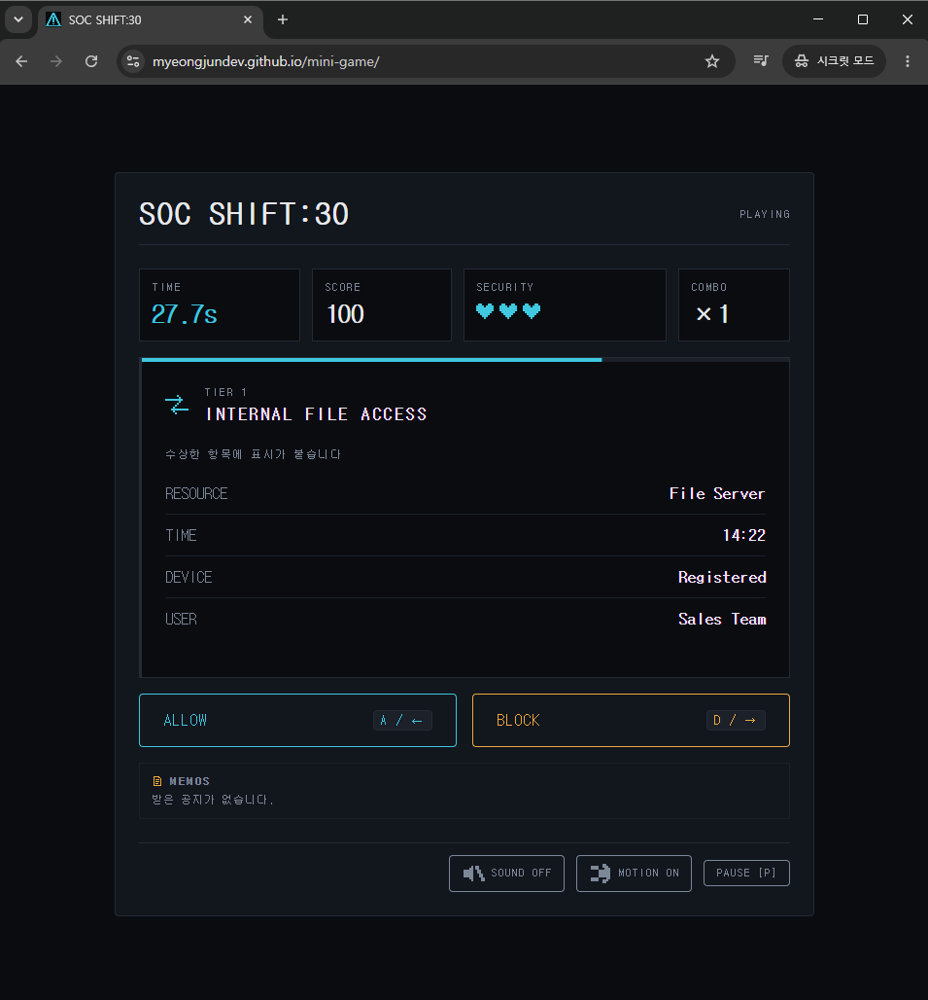</td>
</tr>
<tr>
<td align="center"><b>판정 직전</b><br><code>SCORE 0</code> · <code>COMBO ×0</code></td>
<td align="center"><b>판정 직후</b><br><code>SCORE 100</code> · <code>COMBO ×1</code></td>
</tr>
</table>

등록된 기기가 알려진 SaaS로 보내는 정상 트래픽이라 `ALLOW`가 맞습니다. 라이프는 그대로고 점수와 콤보만 올랐습니다.

---

## 틀리는 방식이 두 가지입니다

이 게임이 정답률 하나로 점수를 매기지 않는 이유입니다.

| | 무슨 일이 벌어졌나 | 현실에서는 |
|---|---|---|
| **오탐**<br>FALSE POSITIVE | 멀쩡한 트래픽을 막았다 | 동료의 업무가 멈춘다 |
| **미탐**<br>MISSED THREAT | 위협을 통과시켰다 | 침해가 일어난다 |

결과 화면은 이 둘을 **따로 세어 막대로 보여줍니다.** 아무거나 다 막아서 버틴 판과 제대로 가려낸 판은 같은 점수가 나오지 않습니다.

<div align="center">
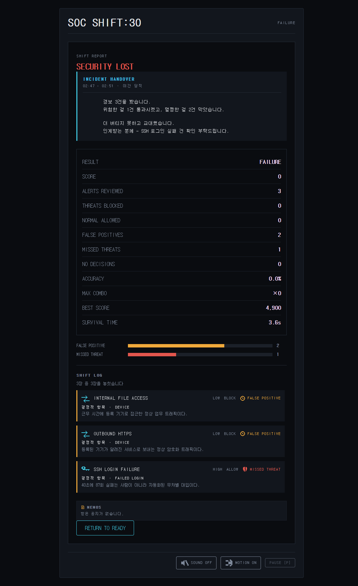
</div>

### 근무가 끝나면 인수인계서를 씁니다

점수판만 나오지 않습니다. 당신이 한 판단이 **다음 근무자에게 넘기는 글**로 정리됩니다. 잘한 것도, 잘못한 것도 그대로 적힙니다.

> **INCIDENT HANDOVER**
> 02:47 – 03:17 · 야간 당직
>
> 경보 18건을 봤습니다.
> 멀쩡한 걸 2건 막았습니다. 아침에 문의가 올 수 있습니다.
>
> 03:08 관제 팀장 통화 — 심야 전송 건 "막아" 지시.
> 지시대로 막았습니다. 등록된 백업 서버로 가는 정기 작업이었습니다.
>
> 인계받는 분께 — 심야 전송 건 확인 부탁드립니다.

---

## 혼자 조용히 경보만 보는 밤은 없습니다

<div align="center">
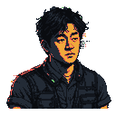
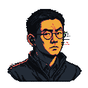
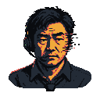

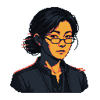
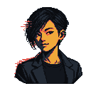
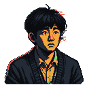
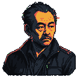
</div>

**📋 사내 공지** — 근무 중에 메모가 뜹니다. 읽는 동안 경보 제한 시간은 멈추지만 **30초 근무 시계는 계속 갑니다.** 그리고 메모 안에 다음 판단의 근거가 들어 있을 때가 있습니다.

> IT팀 · 02:58 — `employee_07` 노트북 교체 완료. 신규 기기 첫 로그인이 곧 잡힙니다.

**📞 상사의 전화** — 받으면 지시가 내려옵니다. **그 지시가 항상 옳지는 않습니다.** 안 받으면 라이프를 잃습니다. 받고 따랐는지, 받고 거슬렀는지, 아예 못 받았는지가 인수인계서에 그대로 남습니다.

---

## 설계에서 고민한 것

**왜 버튼이 두 개뿐인가.** 실제 SOC 업무는 훨씬 복잡합니다. 하지만 처음 보는 사람이 30초 안에 이해하고 끝까지 가야 합니다. 조작을 `ALLOW` / `BLOCK` 둘로 줄이고 **어려움은 조작이 아니라 판단에 두었습니다.**

**왜 화면 전체를 픽셀 폰트로 안 했나.** 도트 감성은 분위기에 좋지만 **숫자와 로그를 읽기 어렵게 만듭니다.** 픽셀 표현은 아이콘과 배경에만 두고, 정보를 읽는 자리는 모노스페이스로 갔습니다.

**움직임 줄이기가 효과를 지우지 않습니다.** 화면 흔들림을 끄면 대신 **테두리가 붉게 번집니다.** 효과를 없애 버리면 라이프를 잃었다는 정보까지 같이 사라집니다. 줄이는 것이지 빼앗는 것이 아닙니다.

<div align="center">
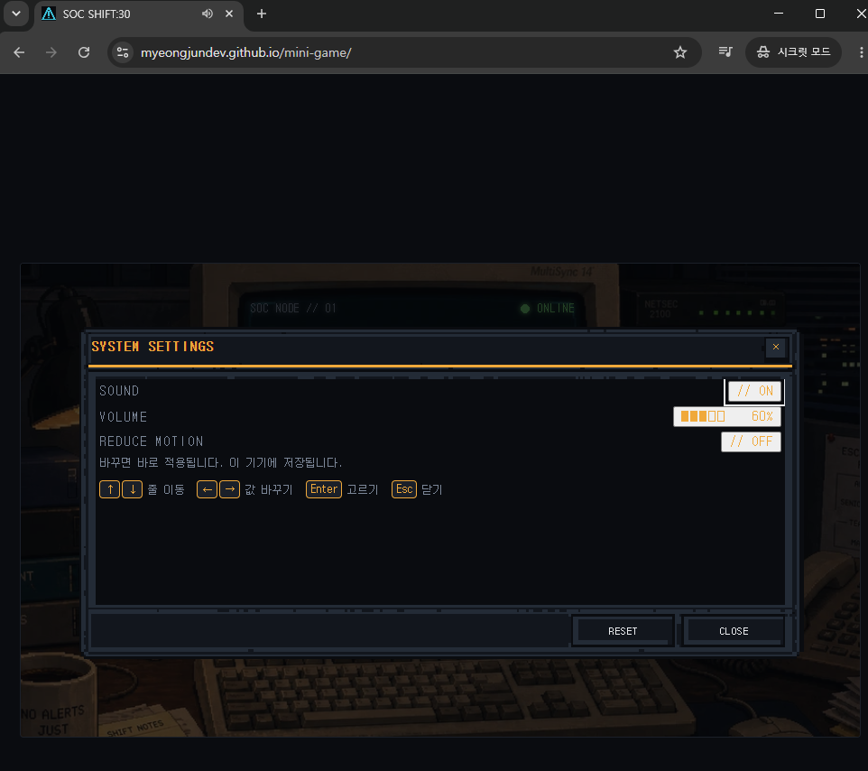
</div>

### 난이도는 감이 아니라 기록으로 정했습니다

경보 한 장의 제한 시간을 얼마로 둘지가 이 게임에서 가장 큰 변수였습니다. **`eventIntervalMs` 하나만 바꾸고 각각 10판씩, 총 20판을 기록했습니다.**

| 제한 시간 | 생존 시간 중앙값 | 정확도 중앙값 | 점수 중앙값 |
|---|---:|---:|---:|
| 2000ms | 7.05초 | 72.5% | 2,300 |
| **3000ms** | **13.75초** | **83.75%** | **3,950** |

2초는 한 줄에 500ms입니다. 사실 네 줄을 읽고 수상한 표시까지 확인하기에 모자랐습니다. 3초로 올리니 생존 시간이 두 배가 됐습니다. **최종값은 3000ms입니다.**

원자료는 [`records/`](records/)에 있습니다. 원하는 결과가 나온 판만 골라내지 않고 20판 전부 적었습니다. 두 조건 모두 30초 완주는 없었다는 한계도 그대로 남겼습니다.

---

## 기술

**React 18 + TypeScript + Vite.** 백엔드 없음. GitHub Actions가 빌드해 GitHub Pages로 올립니다.

```
경보 등장 → 판단 → 즉시 결과 → 점수·라이프·콤보 갱신 → 다음 경보
```

- **규칙과 화면을 분리했습니다.** 게임 규칙은 순수 함수와 리듀서(`game/engine/`)에만 있고 React를 모릅니다. 그래서 브라우저 없이 검사할 수 있습니다.
- **시간은 `requestAnimationFrame` 한 곳에서만 흐릅니다.** 탭이 멈췄다 돌아올 때 밀린 시간이 한꺼번에 들어오지 않게 프레임당 반영량에 상한을 둡니다.
- **저장은 `localStorage`뿐입니다.** 최고 점수와 접근성 설정만 남고 판 진행 상태는 저장하지 않습니다. **저장값이 깨져 있어도** 기본값으로 복구해 정상 실행합니다.
- **BGM 3곡이 상태를 따라갑니다.** 로비 / 근무 중 / **라이프 1개 남았을 때.** 마지막 하나가 남으면 곡이 바뀝니다.

### 검증한 것

| 항목 | 결과 |
|---|---|
| 자동 검사 | **291개 통과** (파일 25개) |
| Lint · 타입 | 오류 0 |
| 연속 실행 | **648초 동안 128판**, 입력 2,517회 처리 후 콘솔 오류 0건 |
| 콘솔 빨간 오류 | 로드 · 플레이 · 재시작 뒤 전부 0건 |
| 가로 넘침 | 1366×768 · 1920×1080에서 **0px** |
| 외부 도메인 요청 | **0건** — 폰트·음원·이미지 전부 자체 호스팅 |
| 번들 크기 | 213 kB (gzip 66.9 kB) |

<div align="center">
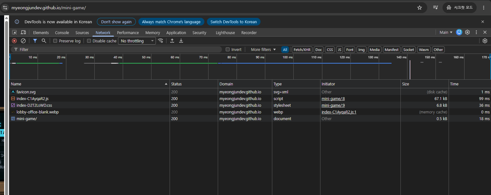
</div>

검사는 화면을 흉내 내지 않고 **실제로 판을 굴려서** 확인합니다. 예를 들어 "연달아 틀렸을 때 두 번째도 화면이 흔들리는가"는 눈으로는 "가끔 안 흔들리는 것 같다"로만 보여서, 검사로 고정해 두었습니다.

---

## 직접 돌려보기

```bash
git clone https://github.com/myeongjundev/mini-game.git
cd mini-game/aleph-t02-soc-shift30
npm install
npm run dev
```

| 명령 | 하는 일 |
|---|---|
| `npm run dev` | 개발 서버 |
| `npm run build` | 타입 검사 후 `../site`에 빌드 |
| `npm test` | 전체 검사 |
| `npm run lint` | ESLint |

---

## 저장소 구조

```text
mini-game/
├─ aleph-t02-soc-shift30/   게임 소스와 구현 명세
│  ├─ src/game/             규칙 — 순수 함수와 리듀서. React를 모른다
│  ├─ src/components/       화면
│  ├─ docs/                 명세 · QA 체크리스트 · 트러블슈팅
│  └─ prompts/              AI 작업 인계서
├─ notes/                   기획, 검사표, 감사 기록
├─ records/                 난이도 실험 20판 원자료
├─ docs/screenshots/        README용 화면 (열어서 확인하고 넣은 것만)
├─ .github/workflows/       Pages 배포
└─ site/                    빌드 산출물 (CI가 만듦, 커밋하지 않음)
```

읽을 만한 문서 두 개를 꼽자면:

- **[`docs/TROUBLESHOOTING.md`](aleph-t02-soc-shift30/docs/TROUBLESHOOTING.md)** — 실제로 터진 버그의 증상·원인·다시 막는 검사. "시계는 흐르는데 키가 안 먹는다" 같은 증상에서 출발해 찾아가는 표가 앞에 있습니다.
- **[`docs/GAME_SPEC.md`](aleph-t02-soc-shift30/docs/GAME_SPEC.md)** — 게임 규칙의 기준 문서.

> **참고** — 검증용 캡처 원본 폴더는 `.gitignore`로 제외됩니다. 화면에 무엇이 찍혔는지는 열어보기 전에 알 수 없고 이 저장소는 공개이기 때문입니다. 위 `docs/screenshots/`에 있는 것은 **한 장씩 열어 확인하고 고른 것만** 넣었습니다.

---

<div align="center">

SKT ALEPH 과제 2 · 2026

**[▶ 플레이](https://myeongjundev.github.io/mini-game/)**

</div>
