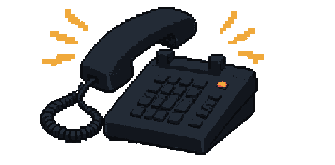
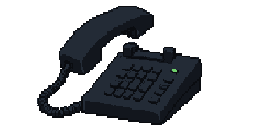
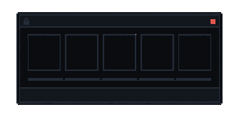
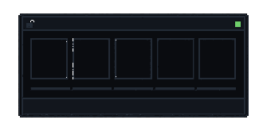

# 전화·패스워드 방해 요소 — Claude 인계 문서

마지막 갱신: 2026-08-20

이 문서는 새로 제작한 이미지 자산과 대화에서 합의한 상호작용 방향을
Claude에게 전달하기 위한 인계 문서다. **이미지 제작은 완료됐지만 게임 규칙과
코드 구현은 아직 완료되지 않았다.**

> `docs/GAME_SPEC.md` 13.10은 현재 상사의 전화와 비밀번호 입력을 "이번 범위
> 밖"으로 두고 있다. 난이도 실험도 아직 시작 전이다. 아래 내용을 바로 코드로
> 옮기기 전에 13.10을 유지할지, 새 규칙으로 승격할지 먼저 사용자와 확인한다.

---

## 1. 최종 사용 자산

모든 이미지는 `335×165px` 저작 해상도이며 화면에서는 `670×330px`로 정확히
2배 확대한다. 배경은 실제 투명 알파이고 안티앨리어싱이 없는 도트 이미지다.

| 상태 | 파일 | 용량 | 실제 사용 |
|---|---|---:|---|
| 전화 수신 중 | `public/phone-call.webp` | 2.39KB | 사용 |
| 전화 연결됨 | `public/phone-connected.webp` | 1.75KB | 사용 |
| 패스워드 잠금 창 | `public/password-window-locked.webp` | 0.56KB | 사용 |
| 패스워드 해제 창 | `public/password-window-unlocked.webp` | 0.75KB | 사용 |

### 미리보기

전화 수신:



전화 연결:



패스워드 잠금 창:



패스워드 해제 창:



### 사용하지 않을 자산

아래 두 파일은 패스워드 요구를 물리 보안 장치로 잘못 이해해 만든 초기안이다.
**모니터에 뜨는 소프트웨어 창이 아니므로 구현에 사용하지 않는다.** 사용자가
삭제를 지시하지 않아 파일은 남겨뒀다.

- `public/password-locked.webp`
- `public/password-unlocked.webp`

---

## 2. 공통 이미지 규격

허용 팔레트는 `src/styles/tokens.css`의 다음 6색뿐이다.

```text
--bg     #0A0C10
--panel  #12161D
--line   #232B36
--amber  #F0A93B
--red    #E2564D
--green  #6FCF6B
```

- 이미지 안에 글자·숫자·상표·로고를 굽지 않았다.
- 전화의 벨 상태는 앰버 색뿐 아니라 진동선 형태로도 보인다.
- 연결 상태는 진동선이 사라지고 수화기가 오프훅이며 녹색 표시가 켜진다.
- 패스워드 상태는 색뿐 아니라 닫힌/열린 자물쇠 실루엣으로도 구분된다.
- WebP 디코딩 기준 알파는 `0` 또는 `255`뿐이다.
- 최종 이미지에는 지정 팔레트 밖의 색이 없다.
- 생성에는 Codex 내장 ImageGen을 썼고 최종 크기·팔레트·알파는 후처리로
  고정했다. 프로젝트 패키지 의존성은 추가하지 않았다.

표시 CSS에는 반드시 다음 성격의 규칙이 필요하다.

```css
image-rendering: pixelated;
```

공개 자산 경로는 로비와 같은 방식으로 `import.meta.env.BASE_URL`을 사용한다.

```tsx
src={`${import.meta.env.BASE_URL}phone-call.webp`}
```

---

## 3. 전화 방해 요소 — 합의된 방향

### 3.1 화면 상태

| 상태 | 이미지 | 동적 HTML |
|---|---|---|
| 수신 중 | `phone-call.webp` | 발신 상태, `↑ 받기`, `↓ 나중에` |
| 연결 전환 | 수신 → 연결 이미지를 즉시 교체 | `LINE CONNECTED`에 해당하는 상태 문구 |
| 통화 중 | `phone-connected.webp` | 발신자, 통화 내용 1~2문장, `↓ 통화 종료` |
| 종료 | 이미지 제거 | 원래 경보 카드 복귀 |

이미지를 부드럽게 섞지 않는다. 도트가 흐려지므로 짧은 하드 컷으로 교체한다.
연결 순간에는 벨을 멈추고 짧은 수화기 소리만 재생한다. 통화 문장은 타자기
효과 없이 한 번에 표시한다.

### 3.2 입력

| 상태 | `↑` | `↓` | `←` / `→` / `A` / `D` |
|---|---|---|---|
| 전화 수신 | 받기 | 지금은 무시 | 전화 오버레이가 열린 동안 판정 차단 |
| 통화 중 | 동작 없음 | 통화 종료 | 판정 차단 |
| 평상시 | 동작 없음 | 동작 없음 | 기존 경보 판정 |

- `↓ 나중에`는 현재 팝업만 닫고 경보로 돌아간다.
- 무시한 전화가 다시 오는 시점과 단계 수는 아직 정하지 않았다.
- 키를 누르고 있을 때 반복 처리되지 않도록 기존 `event.repeat` 가드를
  그대로 적용한다.
- `P` / `ESC` 일시정지는 기존 규칙대로 유지한다.

### 3.3 타이머 제안

전화가 경보 카드를 덮는 동안에는 메모와 같은 공정성 규칙을 적용하는 안을
우선 검토했다.

- 현재 경보 제한시간: 정지
- 30초 근무 시계: 계속 진행

다만 이것은 아직 `GAME_SPEC`에 승인된 규칙이 아니다. 전화를 무시하고 다시
받는 구조, 재수신 간격, 한 판당 횟수와 함께 먼저 명세해야 한다.

### 3.4 통화 내용 방향

전화는 메모와 똑같은 힌트가 아니라 **사람이 주는 권위 압박**으로 차별화한다.
예시는 다음과 같다.

```text
야간 팀장
“VIP 계정이야. 이번 로그인은 그냥 통과시켜.”
```

상사의 말은 정답 명령이 아니라 이후 경보에서 검증해야 하는 단서다. 참인
통화와 위험한 구두 지시의 비율, 연결 경보, 결과 기록 방식은 아직 정하지
않았다.

### 3.5 접근성

- 연결 상태와 통화 내용은 이미지가 아니라 실제 텍스트로 렌더한다.
- 라이브 리전은 “전화 수신”, “통화 연결”, “통화 종료”처럼 짧게 알린다.
- Reduce Motion에서는 눌림·등장 효과 없이 이미지를 즉시 교체한다.
- 음소거 상태에서도 수신/연결/종료를 시각적으로 완전히 알 수 있어야 한다.

---

## 4. 방향키 패스워드 방해 요소 — 합의된 방향

### 4.1 이것은 물리 장치가 아니다

패스워드는 게임 모니터 안에 갑자기 뜨는 **소프트웨어 팝업 창**이다.
최종 자산은 `password-window-*` 두 장이다. `password-locked.webp`와
`password-unlocked.webp`는 이름이 비슷하지만 물리 장치 초기안이므로 쓰지
않는다.

### 4.2 이미지와 HTML의 역할

| 요소 | 담당 |
|---|---|
| 창 테두리, 제목 표시줄, 자물쇠, 상태등, 빈 슬롯 5개 | WebP 이미지 |
| 창 제목과 안내 문구 | HTML |
| 매번 달라지는 `↑ ↓ ← →` 5개 순서 | HTML |
| 입력 완료·오류 상태 | HTML/CSS 상태 클래스 |
| 접근성 이름과 현재 진행도 | HTML/ARIA |

화살표를 이미지에 굽지 않은 이유는 순서가 매번 바뀌어야 하기 때문이다.
잠금 이미지의 빈 슬롯 위에 같은 좌표로 HTML 화살표를 얹는다.

예시 순서:

```text
↑  →  ↓  ←  ↑
```

### 4.3 입력 모드

패스워드 창이 열려 있는 동안에는 방향키 네 개를 패스워드 전용으로 라우팅한다.

- `ArrowUp`, `ArrowDown`, `ArrowLeft`, `ArrowRight`: 다음 순서 입력
- `A`, `D`, `←`, `→`: 경보 판정으로 전달하지 않는다
- `P`, `ESC`: 기존 일시정지
- `event.repeat`: 반드시 무시
- 성공: `password-window-unlocked.webp`로 교체한 뒤 경보 흐름 복귀

정답 입력 슬롯은 앰버로 진행 상태를 표시하고, 다섯 개를 모두 맞추면 녹색
완료 상태로 바꾸는 안을 논의했다. 틀렸을 때 전체 초기화인지 현재 칸 유지인지,
오답 비용이 있는지는 아직 결정하지 않았다.

### 4.4 공정성에서 먼저 결정할 것

`GAME_SPEC` 13.10은 5회 입력이 경보 시간의 일부를 강제로 먹는 문제를 이미
지적한다. 구현 전에 아래 둘 중 하나를 명시적으로 골라야 한다.

1. 패스워드가 경보 한 장 자리를 통째로 대신한다.
2. 경보를 덮는 동안 경보 제한시간을 멈추고 30초 근무 시계만 흐르게 한다.

현재 대화에서는 2안이 전화·메모와 일관된 후보지만 최종 승인은 받지 않았다.
이 결정을 하지 않고 방향키 라우팅부터 구현하면 피할 수 없는 미판정이나
라이프 손실이 생긴다.

---

## 5. 구현 시 건드릴 가능성이 큰 위치

아래는 예상 경계일 뿐, 현재 구조를 다시 읽고 가장 작은 변경으로 설계한다.

- `src/App.tsx` — 오버레이 상태와 화면 연결
- `src/game/types.ts` — 전화·패스워드 상태 타입
- `src/game/config.ts` — 등장 횟수·시점·재수신 간격 같은 확정 상수
- `src/game/engine/machine.ts` — 순수 상태 전이
- `src/game/hooks/useKeyboard.ts` — 상태별 입력 라우팅과 `event.repeat`
- `src/game/hooks/useGameLoop.ts` — 경보 제한시간 정지 여부
- `src/components/` — 전화 및 패스워드 오버레이 컴포넌트
- `src/styles/global.css` — 670×330 고정 오버레이와 반응형 표시
- `docs/GAME_SPEC.md` — 승인된 규칙의 단일 원본
- `docs/QA_CHECKLIST.md` — 전화·패스워드 수동/자동 검사 추가

현재 작업트리에는 메모 멈춤 버그 수정과 문서 변경이 커밋되지 않은 상태다.
`git checkout --`, reset, 대량 치환으로 기존 변경을 지우지 않는다.

---

## 6. 최소 테스트 목록

규칙 승인 후 구현한다면 적어도 다음을 자동 검사한다.

### 전화

- `↑` 한 번에 수신 처리가 정확히 한 번만 일어난다.
- `↓ 나중에` 후 현재 경보가 정상적으로 다시 판정된다.
- 통화 중 `A` / `D` / `←` / `→`가 경보를 판정하지 않는다.
- 통화 종료 후 판정 입력이 복구된다.
- 전화 중 경보 제한시간과 근무 시계가 확정한 규칙대로 움직인다.
- 재시작 후 전화 상태·재수신 단계가 초기화된다.

### 패스워드

- 같은 시드에서는 같은 5키 순서가 나온다.
- 정확한 순서에서만 해제된다.
- `event.repeat`는 진행도를 올리지 않는다.
- 패스워드 중 좌우 방향키가 경보 판정으로 새지 않는다.
- 오답 처리와 타이머가 확정한 규칙대로 동작한다.
- 일시정지 중 입력이 진행되지 않는다.
- 재시작 후 순서와 진행도가 초기화된다.

### 화면·접근성

- 1366×768, 1920×1080, 640px, 390×844에서 잘림과 스크롤이 없다.
- `image-rendering: pixelated` 상태로 정확히 2배 표시된다.
- Reduce Motion에서 동작 정보가 사라지지 않는다.
- 흑백에서도 수신/연결, 잠금/해제가 구분된다.
- 화면 읽기 기능이 현재 방해 상태와 진행도를 알 수 있다.

---

## 7. Claude에게 전달할 짧은 프롬프트

```text
prompts/03_PHONE_PASSWORD_DISTRACTIONS_HANDOFF.md를 먼저 읽어라.

전화와 방향키 패스워드용 이미지 자산은 제작과 파일 검수가 끝났다.
다만 docs/GAME_SPEC.md 13.10은 두 기능을 아직 범위 밖으로 두고 있으므로,
바로 구현하지 말고 현재 코드와 미커밋 변경을 먼저 확인해라.

먼저 다음만 보고해라.
1. 기존 MEMO 상태·타이머·입력 구조에 두 기능을 넣을 때 충돌하는 지점
2. 구현 전에 확정해야 하는 게임 규칙
3. 가장 작은 상태 모델과 테스트 계획
4. 사용 자산과 사용 금지 자산 구분

사용자에게 규칙 확인을 받은 뒤에만 구현을 시작해라.
기존 미커밋 변경을 덮어쓰거나 게임 규칙을 임의로 확정하지 마라.
```

